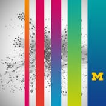

## [Coursera Applied Data Science with Python Specialization](https://www.coursera.org/specializations/data-science-python)

> **This skills-based specialization will equip you with the skills you need to apply statistical, machine learning, information visualization, text analysis, and social network analysis techniques through popular python toolkits such as pandas, matplotlib, scikit-learn, nltk, and networkx to gain insight into their data.**

There are 5 Courses in this Specialization:
1.  Introduction to Data Science in Python
2.  Applied Plotting, Charting & Data Representation in Python
3.  Applied Machine Learning in Python
4.  Applied Text Mining in Python
5.  Applied Social Network Analysis in Python

---
 Not Started &nbsp;&nbsp;
 Working On &nbsp;&nbsp;
 Finished
